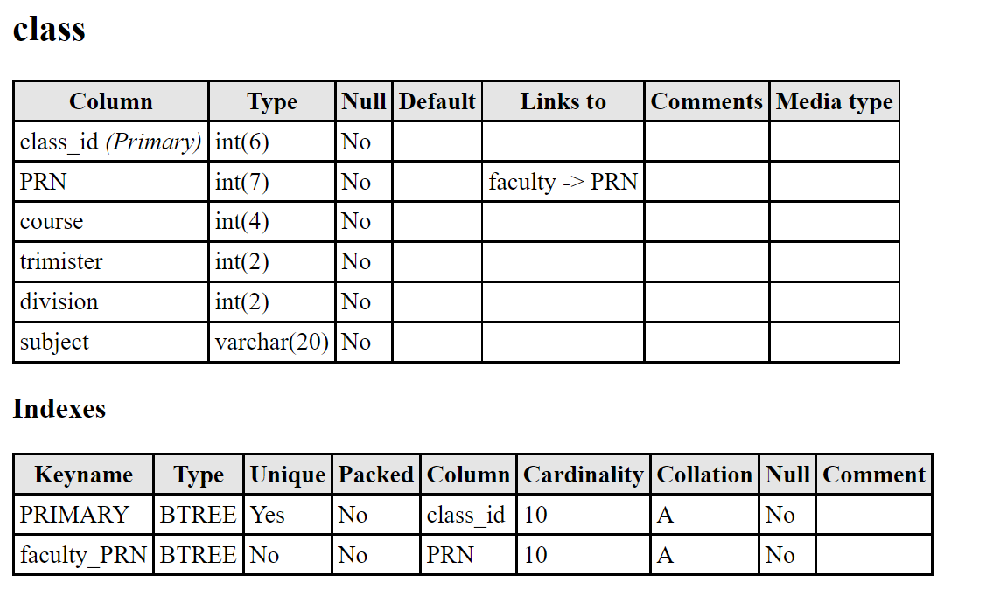
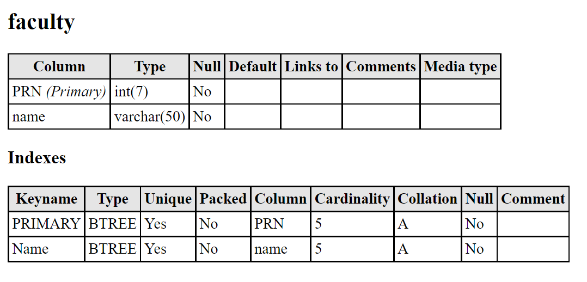
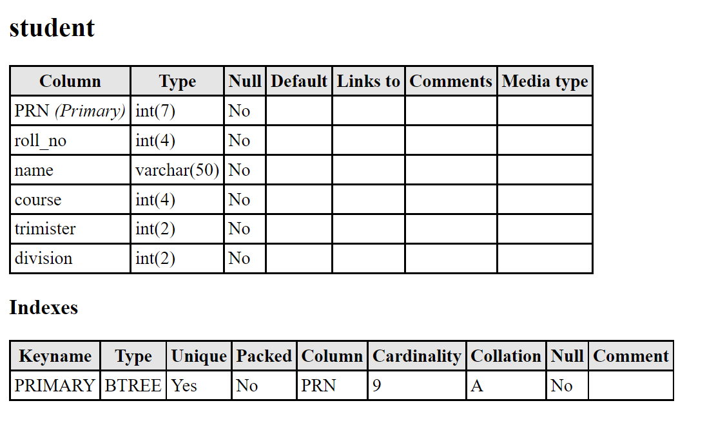
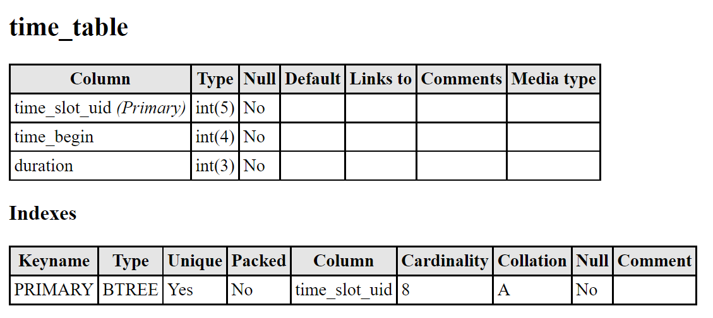



**FACULTY OF SCIENCE**

**SCHOOL OF COMPUTER SCIENCE**

**2021-2022**

**A**

**PROJECT REPORT**

**ON**

Intelligent Facial Recognition Attendance System 

Using Live Video Feed

**BY**

**Prajyot Zankar** 

**Malhar Yadav**

**Rahul Burghate**

**IN PARTIAL FULFILLMENT OF** 

**BACHELOR OF SCIENCE (COMPUTER SCIENCE)**

**MIT WORLD PEACE UNIVERSITY**

`						`INDEX

|**Sr. No.**|**Contents**|**Page No.**|
| :-: | :-: | :-: |
|**Chapter 1**|**INTRODUCTION**|6|
||1.1   Scope|7|
||1.2   Objective|7|
||1.3   Problem Statement|8|
|**Chapter 2**|**PROPOSED SYSTEM**|9|
||2.1   Proposed System|10|
||2.2  Working of  Proposed System|10 - 11|
||2.3  Features of the Proposed System|12|
||2.4 System Requirements |12 - 13|
||2.5 Technology Description|13 - 14|
|**Chapter 3**|**ANALYSIS AND DESIGN**|15|
||
3.1  Module List

|16 |
||3.2  UML Diagram (respective diagrams)|16 - 20|
||3.3  Outlook|21 - 24|
|**Chapter 4**|4.1  Manual Testing|26|
||4.2  Other testing|26 |
|**Chapter 5**|
**CONCLUSION**

|27|
||
5.1   Future Enhancements

|28|

**CHAPTER - 1**

**INTRODUCTION**

**Chapter 1: Introduction** 

**1.1** **Scope**

- Student and Faculty Registration by Admin
- Login & Logout
- View Attendance & Timetable (Admin)
- Modify/Update Attendance (Admin)
- Modify/Update Timetable ( Admin)
- Add user data to database (Admin)
- Manage Machine Learning System(Admin)

Future Scope**:**  

- Performance metrics monitoring Dashboard.
- View Attendance & Timetable (Students)
- Modify/Update Attendance (Faculty)

**1.2** **Objective** 

1. This system completely automates the attendance routine.
1. It will also prevent the activity of taking attendance via traditional way from consuming valuable and already limited lecture time.
1. All attendance information is readily accessible to end-users.
1. This system prevents proxy and faulty attendance marking.

**1.3 Problem Statement**

Attendance marking in a classroom during a lecture is not only burdensome but also a time-consuming task. Old-school attendance systems are no longer efficient enough for keeping track of student attendance. Sign sheet, roll call, RFID-based systems, punch-card systems, swipe card systems, and biometric systems such as fingerprint analysis, iris analysis, and so on are all available for recording attendance in schools or universities. All of these systems have some or all of the following disadvantages: cause disruption to event conduct, high upfront costs, the possibility of proxy and incorrect input, a kiosk can only handle one user at a time, which can cause huge delays when a large number of users want to mark their attendance, especially in colleges and schools. Some more advanced systems have been proposed or are in the experimental stage in recent years that overcome some of the previously described concerns, although they have their downsides. One such system requires students to travel along a certain corridor, which may cause delays when a large number of students seek to indicate their attendance. Most existing solutions are invalid or impracticable for institutions that require attendance to be conducted on a per-time-slot basis. All of these issues are addressed by the proposed solution.

**CHAPTER - 2**

**PROPOSED SYSTEM**

**Chapter 2: Proposed System**

**2.1 Proposed System** 

The proposed system processes the video feed of CCTV cameras installed in the classroom to capture face samples of subjects in the CCTV cameras' field of view and feed them to a Facial recognition system based on very popular Python libraries maintained by tech giant Google to perform facial recognition using Deep Learning CNN model pre-trained for face detection and general face recognition and then trained on the dataset consisting of current students and faculties, and then continuously updated and retrained on new admissions of students and faculties every year or as needed, to recognise the subject's identity based on the student and faculty records maintained by the institution they are present at, and mark their attendance based on date, time slot, subject of attendance, and so on. The attendance will be stored in a MySQL based database and can be edited by the faculty up to a limited time and by admin indefinitely. Students and faculty can view their attendance records.

**2.2 Working of the Proposed System**

The live video feed from the CCTV cameras installed in the classrooms/lecture halls is sent to an intranet server, where it is first pre-processed, and each detected face is cut out of the frame captured, passed on as individual images, and transformed into a valid input format for the facial recognition model. The model runs facial recognition on each face image and outputs a list of names of people recognised. This list is subsequently passed as an argument in MySQL query, which updates attendance in the institute's relational database. Different views of this Relational database are leveraged to provide different information to different types of end-users on the website. The web platform features three classes of users: admin, faculty, and student. Each has varied access and is shown information based on their class. Admins have complete control and can access and edit all records.

PAGE1 | .

**2.3 Features of the Proposed System**

1. Minimum input required. 
1. A high-accuracy, efficient, and simple system for capturing, processing, and maintaining attendance records.
1. There is no disruption to the event (lecture).
1. An intuitive and simple-to-use web gateway where,
   1. Students and faculty to view their attendance records. 
   1. Faculties can generate attendance and defaulter reports on a weekly, monthly, and trimester/semester basis.
   1. faculty and system admin can easily remedy any errors in attendance.
1. The solution is resistant to time slot alterations by faculty/admin since it cross-verifies the subject to mark attendance against the faculty present.
1. Because most institutions have CCTV cameras installed in classrooms and lecture halls, this system offers a lower beginning cost than other systems. Furthermore, CCTV installation and setup is less expensive and more versatile than other systems.
1. It is simple to integrate with the institute's existing ERP system.

**2.4 System Requirements:**

- Developer
  - Enthusiast grade or above CPU
  - GPU with CUDA cores (Nvidia 20 series or higher)
  - Python Development environment (python ide with libraries like TensorFlow, OpenCV2, )
  - Web-Development environment(bootstrap)
  - Backend (MySQL database, Django Framework)
  - For collaboration, Git: 2.29.0/GitHub web and live share in VSCode
  - SSD storage 1TB recommended.
  - RAM 16 GBs

- Admin
  - Server Side
    - Server grade CPU
    - Server grade GPU with CUDA cores (Nvidia 3090 or better)
  - UI Side
    - A basic fully functioning computer/mobile phone with a web browser installed.
    - Stable internet connection
    - Stable connect to intranet (to monitor CCTV cameras)
- End-User (Students and Faculties)
  - A basic fully functioning computer/mobile phone with a web browser installed.
  - Stable internet connection.

2.5 Technology Description 

**Django:** Django is a high-level Python web framework that enables the rapid development of secure and maintainable websites. Built by experienced developers, Django takes care of much of the hassle of web development, so you can focus on writing your app without needing to reinvent the wheel. It is free and open-source, has a thriving and active community, great documentation, and many options for free and paid-for support.

**Python**: Python is an interpreted, object-oriented, high-level programming language with dynamic semantics. Its high-level built-in data structures, combined with dynamic typing and dynamic binding, make it very attractive for Rapid Application Development, as well as for use as a scripting or glue language to connect existing components. The Python interpreter and the extensive standard library are available in source or binary form without charge for all major platforms and can be freely distributed.

**XAMPP**: XAMPP is an abbreviation for cross-platform, Apache, MySQL, PHP and Perl, and it allows you to build WordPress site offline, on a local web server on your computer. This simple and lightweight solution works on Windows, Linux, and Mac – hence the “cross-platform” part.

**MySQL**: MySQL is an Oracle-backed open-source relational database management system (RDBMS) based on Structured Query Language (SQL). MySQL runs on virtually all platforms, including Linux, UNIX and Windows. MySQL is based on a client-server model. The core of MySQL is MySQL server, which handles all of the database instructions (or commands). MySQL server is available as a separate program for use in a client-server networked environment and as a library that can be embedded (or linked) into separate applications.

**IDE**: An integrated development environment (IDE) is a software application that provides comprehensive facilities to computer programmers for software development. 

**•Visual Studio Code:** Visual Studio Code is a freeware source-code editor made by Microsoft for Windows, Linux and macOS. Features include support for debugging, syntax highlighting, intelligent code completion, snippets, code refactoring, and embedded Git.

**TensorFlow :**  TensorFlow is an interface for expressing machine learning algorithms and an implementation for executing such algorithms.

**GitHub**: A provider of Internet hosting for software development and version control using Git. It offers the distributed version control and source code management functionality of Git, plus its features.

**CHAPTER -3**

**ANALYSIS AND DESIGN**
##

**Chapter 3: Analysis and Design**
## **3.1 Module List**

● Developing an Attendance management system.

● Keeping records of users(Students, Faculty, Admins).

● Developing web application for attendance management
##
## **3.2 UML Diagram** 

3.2.1 Functional Decomposition Diagram:

 

3.2.2 Use Case Diagram:

3.2.3 Sequence diagram :

 	 A :  Login:

B: Attendance Marking 

3.2.4: Class Diagram

3.2.5:Activity diagram:

##
##
##
##
##

## **3.3 Outlook**
Design:

This is the initial design and we have tried to complete it as close to the design and is not final. We keep updating the designs as per our needs.

**(\*This does not depict final UI and are subject to change)**

Data Dictionary or Metadata Repository:

 

Database Diagram :

**CHAPTER – 4**

**TESTING**

**Chapter 4: Testing**

**4.1 Manual Testing**

Tested on multiple web browsers on multiple screen sizes and it works performs well with the margin of error.

Unit testing: Still work in progress. We’ll do this testing after we have achieved our primary goals and this too involves learning about the same.

**4.2 Other Testing**:

1) Functional testing: It performs the basic operation as mentioned in the Scope of the project.
1) Performance Testing: Slight improvement in loading images and response time.
1) Testing on multiple platforms will be done after the final polished app for android is completed so that the same project can be built for other platforms.

**CHAPTER – 5**

**CONCLUSION**

` `**Chapter 6: Conclusion**

**6.1 Future Enhancements:**

- Future developments include a faster and more optimised system that can run efficiently on less expensive hardware.
- An automated Attendance System can be implemented in larger areas like in a seminar hall where it helps in sensing the presence of many people.
- Sometimes the poor lighting condition of the classroom may affect image quality which indirectly degrades system performance, this can be overcome in the latter stage by improving the quality of the video or by using some image processing algorithms.

**References:**

- K, M. K., & A, V. M. (2013, November 13). *Smart application for ams using face recognition*. arXiv.org. https://arxiv.org/abs/1401.6130. 
- S. Dev and T. Patnaik, "Student Attendance System using Face Recognition," 2020 International Conference on Smart Electronics and Communication (ICOSEC), 2020, pp. 90-96, doi: 10.1109/ICOSEC49089.2020.9215441.
- R. Dmello, S. Yerremreddy, S. Basu, T. Bhitle, Y. Kokate and P. Gharpure, "Automated Facial Recognition Attendance System Leveraging IoT Cameras," 2019 9th International Conference on Cloud Computing, Data Science & Engineering (Confluence), 2019, pp. 556-561, doi: 10.1109/CONFLUENCE.2019.8776924.
- R. S. Siswanto, A. S. Nugroho and M. Galinium, "Implementation of face recognition algorithm for biometrics-based time attendance system," 2014 International Conference on ICT For Smart Society (ICISS), 2014, pp. 149-154, doi: 10.1109/ICTSS.2014.7013165.

